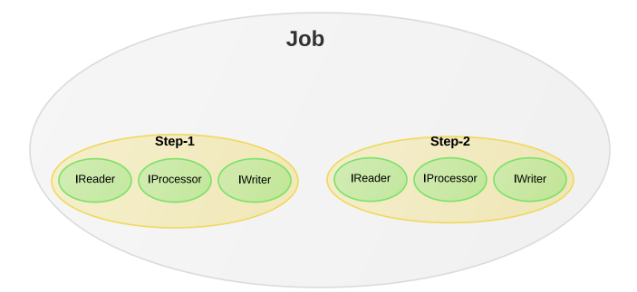

## Quick view of Job


## How Step works


## Getting Started
__NBatch__ can be installed via Nuget and consists of a single `.dll`. It should also create a folder named _sql_ containing scripts to create the necessary schemas for NBatch to work.


###### Job
A Job consists of steps and when executed will process each step sequentially. When creating a Job you must give it a unique name and a connection string name for the database where the above scripts were executed.    
```C#
	public Job(string jobName, string connectionStringName)
```   

###### Step
A Step has three main parts one of which is optional.  

- IReader<T\>: Used to read data from various sources (file, database, etc,.) and feeds it into the processor.  
	 

- IProcessor<T, U>: Handles any intermediary processes before sending it to a writer. Uses a default implementation if no custom implementation is provided.  

- Writer<U\>: Used to write/save the items passed in through the processor.  

A Step also supports logic for skipping certain types of `ERRORS` as well as the `NUMBER` of times each errors should be skipped before throwing an exception. 


